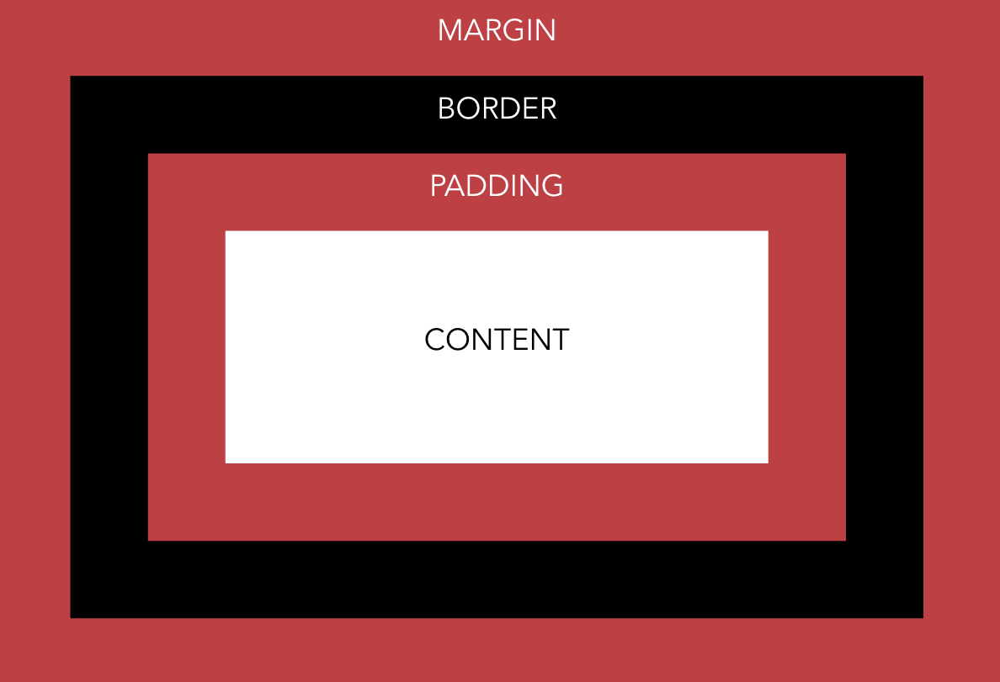

# Blueprint Web Basics Workshop

In this workshop, you will get your hands dirty by creating and editing HTML files. Download this repository to your computer, then work through the following steps.

Below you will find **ACTIONABLES**. These are things that you should do in order to complete this workshop. For a lot of these tasks, it will not be very straightforward how you are supposed to do them. The goal of this workshop is for you to be able to look things up on your own online and figure out the solutions. 

## **Step 1:** Read Through the `head` Tag

The `head` tag in this HTML file contains some tags that we didn't go through. Read through the description to familiarize yourself with those new tags.

At the bottom of the `head` tag, you'll notice that the CSS file is not linked. 

**ACTIONABLE:** Link the CSS file that is located in the folder `/css/style.css` to your HTML so that your HTML can use the styling from the CSS file.

To check if your file worked, notice that the font will change from *Times New Roman* to *Helvetica*.

**NOTE:** You will find another css file (`/css/solution.css`). DON'T open this file unless you want to cheat into the solution. We can look at the solution together later on. 

After that, ignore the CSS for now. We will get back to it later.

## **Step 2:** Read Through the `body` Tag

Read through the HTML to understand that it's doing. When you're done, you can open the file to see what it's like. This will open with your default browser. If it's not Chrome, choose to open it with Chrome (and maybe set it as your default browser).

**ACTIONABLE:** At some point in the HTML, it says "Robert Vunabandi". Change that to your name and where you are from instead.

**ACTIONABLE:** Change the unordered list to display the things that you like.

**ACTIONABLE:** Now, add an *ordered list* to the HTML where it says so.

Once done, refresh to page to see the update.

## **Step 3:** CSS Time

We're gonna spend the bulk of this workshop in CSS. Let's play around with multiple things.

### Open `/css/style.css`

You notice that we have the following inside this css file:

```css
* {
	font-family: helvetica;
}

```

This is a CSS Selector that selects every single elements and applies the styling within that block to every HTML element on the page. 

Inside the [CSS Selectors from W3Schools](https://www.w3schools.com/cssref/css_selectors.asp), they show you how to do more fancy types of selections. 

**ACTIONABLE:** Using the W3Schools' CSS Selector guide, select every `span` that are inside every `p` tag and make them bold. 

---

Now, let's add some color and shape to our website.

**ACTIONABLE:** Make all `h1` elements blue.

**ACTIONABLE:** Make all texts centered.

Refresh the page to see the changes!

---

Now, it's time to learn about CSS's box model. Remember how every element in the HTML is a box? Well, each of those elements have the following:

- Margin
- Border
- Padding



***TODO: Continue with this***


## **BONUS:** Get Even Dirtier!

**ACTIONABLE:** Use [Google Fonts](https://fonts.google.com/) to pick and use an even cooler font in your website. 

**ACTIONABLE:**

